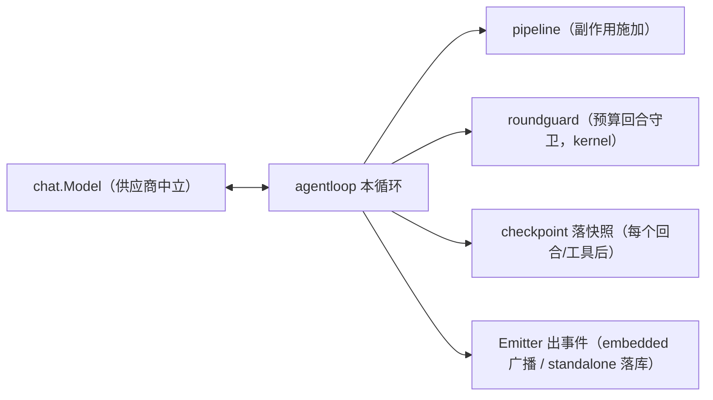
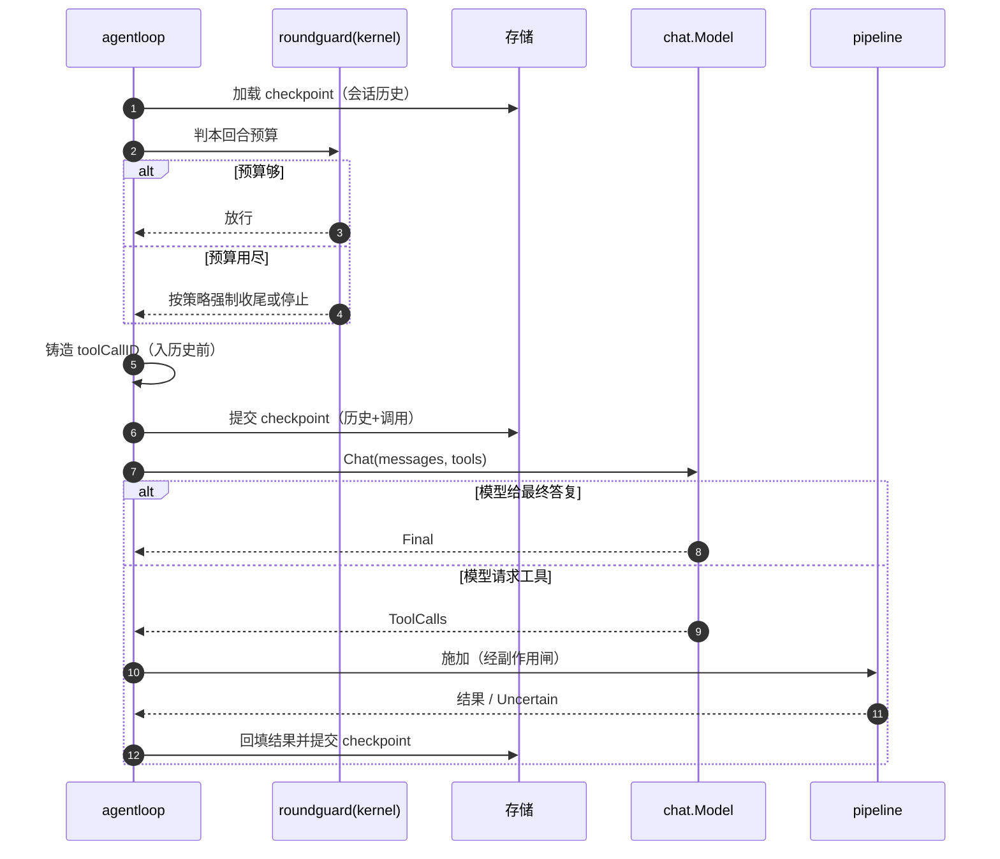
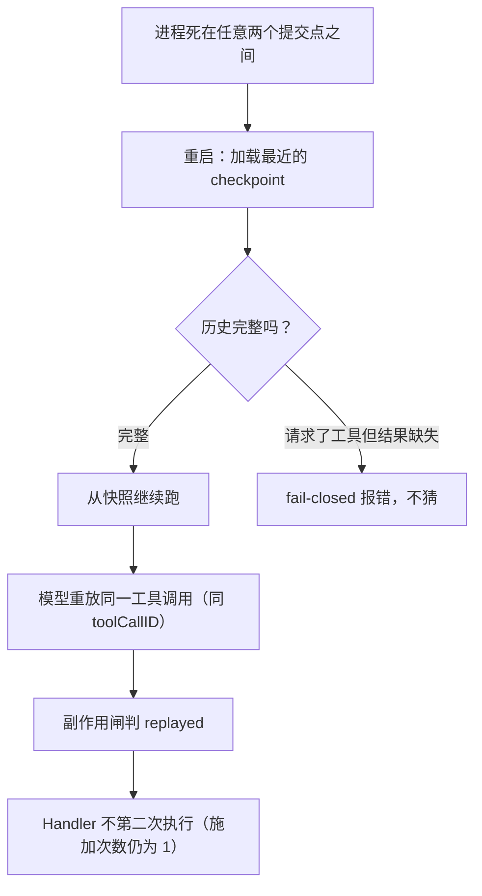
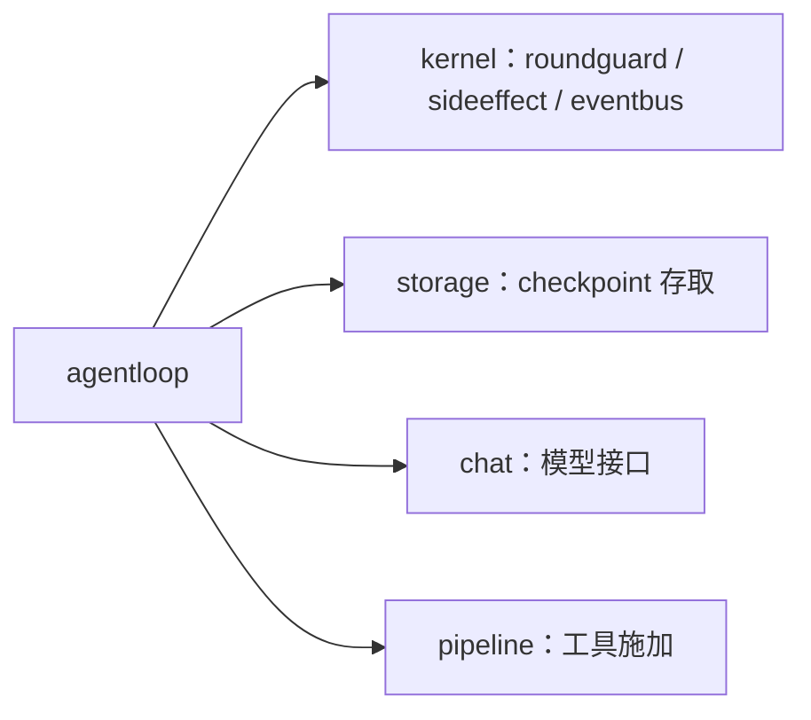

# agentloop：可恢复回合循环

**一句话**：模型 ↔ 工具之间跑回合，每个提交点落检查点，死了能从存储恢复且副作用不重放。这是全仓的心脏。

## 它串起了什么

```mermaid
flowchart LR
    CH["chat.Model（供应商中立）"] <--> LP["agentloop 本循环"]
    LP --> PL["pipeline（副作用施加）"]
    LP --> RG["roundguard（预算回合守卫，kernel）"]
    LP --> CP["checkpoint 落快照（每个回合/工具后）"]
    LP --> EM["Emitter 出事件（embedded 广播 / standalone 落库）"]
```

## 一次循环的完整时序

```mermaid
sequenceDiagram
    autonumber
    participant LP as agentloop
    participant RG as roundguard(kernel)
    participant ST as 存储
    participant MD as chat.Model
    participant PL as pipeline

    LP->>ST: 加载 checkpoint（会话历史）
    LP->>RG: 判本回合预算
    alt 预算够
        RG-->>LP: 放行
    else 预算用尽
        RG-->>LP: 按策略强制收尾或停止
    end
    LP->>LP: 铸造 toolCallID（入历史前）
    LP->>ST: 提交 checkpoint（历史+调用）
    LP->>MD: Chat(messages, tools)
    alt 模型给最终答复
        MD-->>LP: Final
    else 模型请求工具
        MD-->>LP: ToolCalls
        LP->>PL: 施加（经副作用闸）
        PL-->>LP: 结果 / Uncertain
        LP->>ST: 回填结果并提交 checkpoint
    end
```

## 恢复语义（本包要点，也是本仓卖点）

```mermaid
flowchart TB
    DIE["进程死在任意两个提交点之间"] --> LOAD["重启：加载最近的 checkpoint"]
    LOAD --> CHECK{"历史完整吗？"}
    CHECK -->|完整| OK["从快照继续跑"]
    CHECK -->|"请求了工具但结果缺失"| FAIL["fail-closed 报错，不猜"]
    OK --> REPLAY["模型重放同一工具调用（同 toolCallID）"]
    REPLAY --> GATE["副作用闸判 replayed"]
    GATE --> SAFE["Handler 不第二次执行（施加次数仍为 1）"]
```

这套语义由 `agentloop` / `runtime` 的端到端用例钉住：测试断言「施加次数仍为 1」。

## 依赖

```mermaid
flowchart LR
    LP["agentloop"] --> K1["kernel：roundguard / sideeffect / eventbus"]
    LP --> ST["storage：checkpoint 存取"]
    LP --> CH["chat：模型接口"]
    LP --> PL["pipeline：工具施加"]
```
